<h1 align="center">Magic Match</h1>

<h4>Welcome to Magic Match, a single-player card game testing memory recall and speed.</h4>

[View the live project here.](https://mcranter.github.io/Milestone-2/index.html)


## User Experience (UX)

-   ### User stories

    -   #### General User Goals

        1. As a user, I want to be able to read the games instruction (how to play the game)
        2. As a user,  I want to be able to toggle on/off the game sound.
        3. As a user, I want to be able to keep track of the amount of flips it has taken me to complete the game.
        4. As a user, I want to see how long it has taken me to complete the game. 
        5. As a user, I want an alert when I get a match.

    -   #### Casual Player Goals

        1. As a casual gamer, my priority is a fun gameplay experience.
        2. As a casual gamer I want the gameplay mechanism to be immediately obvious.
        3. If a level is too hard, I want the option to quit.

    -   #### Experienced Player Goals

        1. As an experienced gamer I want to be challenged.
        2. As an experienced gamer I want a game that encourages repeat plays.

    -   #### Game Designer's Goals
        1. To engage and entertain both casual and experienced game players.
        2. To create an enjoyable, rewarding bug-free gameplay experience.
        3. To encourage multiple replays.

    -   ### Design
    -   #### Colour Scheme
        -   The main colours used are Yellow (#ebd512) and dark-orange(#f0Ad4e) for titles and modal backgrounds and Black and White for fonts.
    -   #### Typography
        -   The Grenze Gotisch font is the main font used in the game. This font was chosen for its evocative qualities, conjuring a gothic yet 'magical' sensibility that reflects the game's theme.
        -   Grenze Gotisch is a Google Font.
    -   #### Imagery
        -   The castle background is intended to compliment the 'Grenze Gotisch' font by reflecting the magical, gothic theme.

*   ### Wireframes

    -   Home Page Wireframe (Desktop/Mobile) - [View](https://bit.ly/34GYUjW)
    -   Game board Wireframes (Desktop/Mobile) - [View](https://bit.ly/2Fl7tsa), [View](https://bit.ly/33Q3hKn)
    -   Victory Modal Wireframe - [View](https://bit.ly/3nH8P1W)


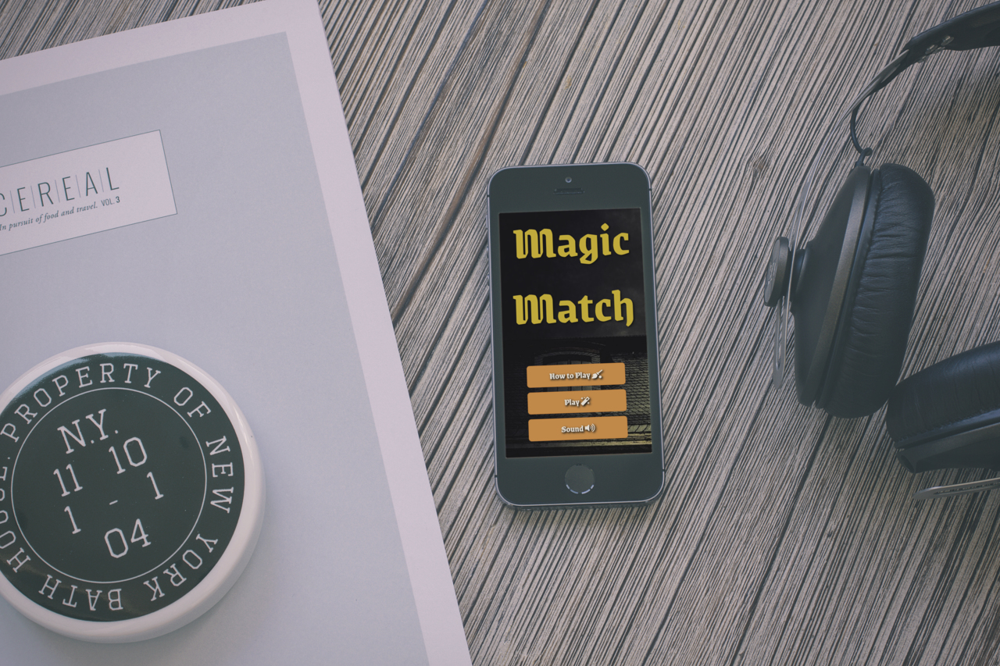


## Features

### Existing Features

-   Sounds: This game uses sounds to alert the player to various events (like the existence of a match, victory or the end of the game.) Using sounds during these events also helps create [positive reinforcement ](https://game-design-snacks.fandom.com/wiki/Positive_Reinforcement_Through_Audio_Visual_Cues) which encourages repeat game playing.

-   Interactive play mechanism playable on all devices.


### Future Features

-   Scoreboard: A scoreboard would add to the competitive element of the game and increase replay value.

-   Card Match counter: Not included initially due to concerns about the display looking crowded (with flip, time, and level already displayed).


## Technologies Used

### Languages Used

-   [HTML5](https://en.wikipedia.org/wiki/HTML5)
-   [CSS3](https://en.wikipedia.org/wiki/Cascading_Style_Sheets)
-   [Javascript](https://en.wikipedia.org/wiki/javascript)


### Frameworks, Libraries & Programs Used

1. [Bootstrap 4.4.1:](https://getbootstrap.com/docs/4.4/getting-started/introduction/)
    - Bootstrap was used to assist with the layout and styling of the landing menu.
1. [Hover.css:](https://ianlunn.github.io/Hover/)
    - Hover.css was used to all buttons to add the float transition while being hovered over.
1. [Google Fonts:](https://fonts.google.com/)
    - Google fonts were used to import the 'Grenze' font into the style.css file which is used on pages throughout the project.
1. [Font Awesome:](https://fontawesome.com/)
    - Font Awesome was used on several pages throughout the website to add icons for aesthetic and UX purposes.
1. [jQuery:](https://jquery.com/)
    - jQuery was used to create elements of the game's functionality.
1. [Git](https://git-scm.com/)
    - Git was used for version control by utilising the Gitpod terminal to commit to Git and Push to GitHub.
1. [GitHub:](https://github.com/)
    - GitHub is used to store the projects code after being pushed from Git.
1. [Zapsplat:](https://www.zapsplat.com/)
    - Zapsplat was used to source the sounds used in this game.
1. [Pixabay:](https://www.pixabay.com/)
    - Pixabay was used to source the background image for this game.
1. [RW Designer](http://www.rw-designer.com/)
    - Cursor icon sourced from site user LightningBoy2527.
1. [Figma:](https://figma.com/)
    - Figma was used to create the [wireframes](https://bit.ly/2Z71nme) during the design process.
1. [Pinterest:](https://pinterest.com/)
    - Pinterest was used to source the fan-made clip art images used on the card fronts.
1. [Magic Mockups:](https://magicmockups.com/)
    - Magic Mockups was used to generate images used through this file.    


## Testing

The W3C Markup Validator and W3C CSS Validator Services were used to validate every page of the project to ensure there were no syntax errors in the project.

-   [W3C Markup Validator](https://jigsaw.w3.org/css-validator/#validate_by_input) -
Results
1. Index 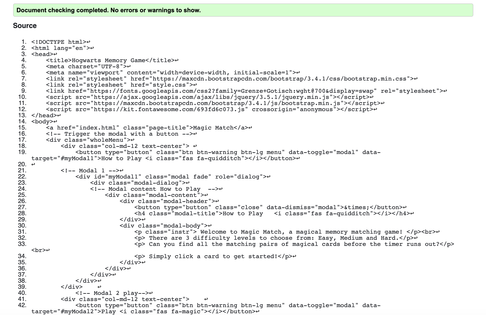
2. Easy 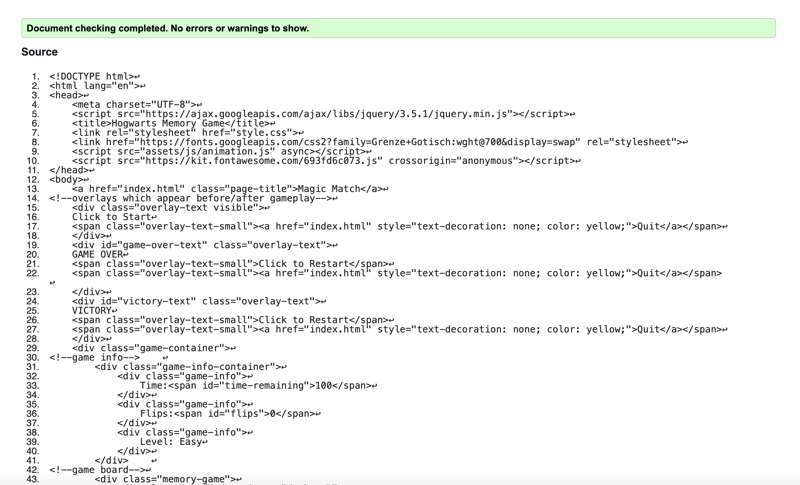
3. Medium 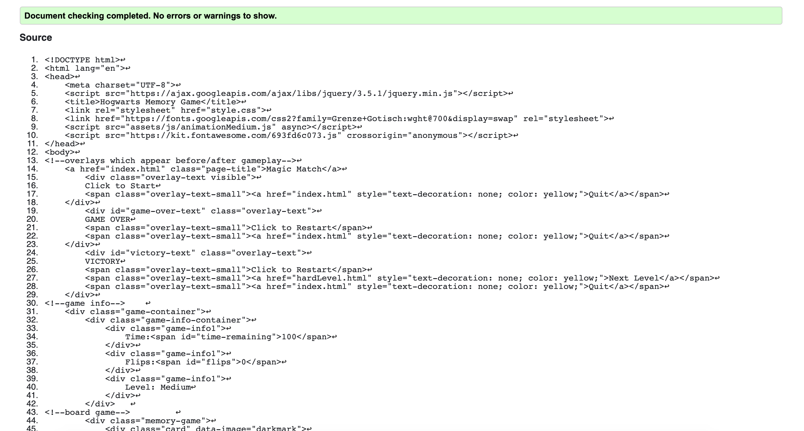
4. Hard 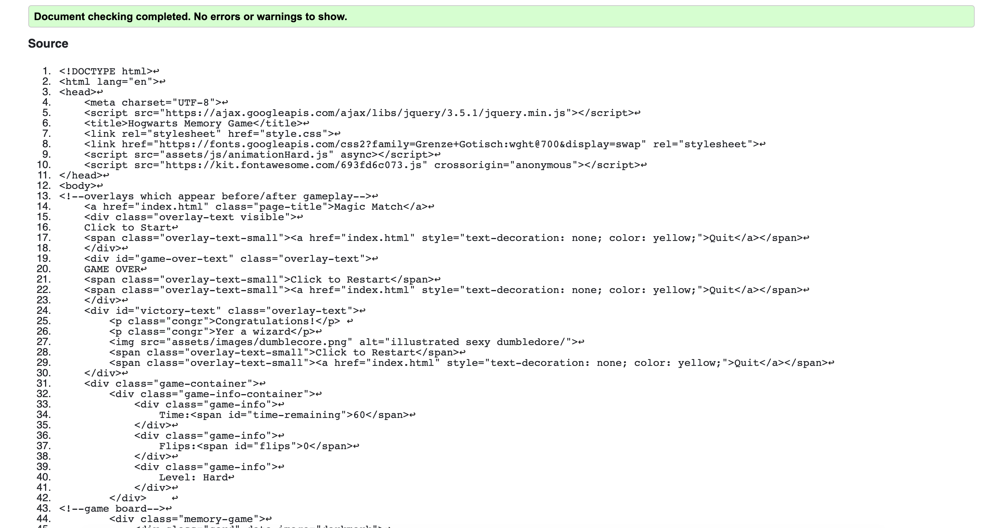

-   [W3C CSS Validator](https://jigsaw.w3.org/css-validator/#validate_by_input) - Results
1.  CSS 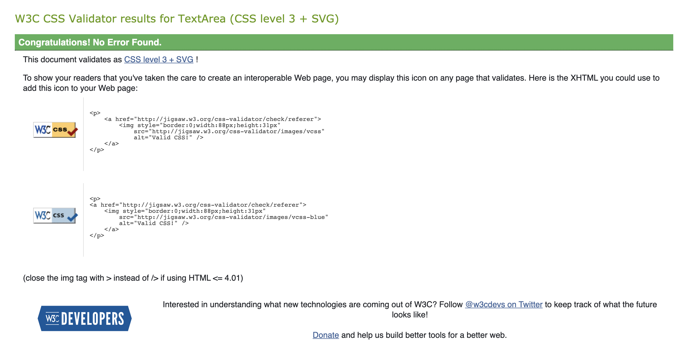

-   [Javascript Validator](https://validatejavascript.com/) - 
Results
1. Animation 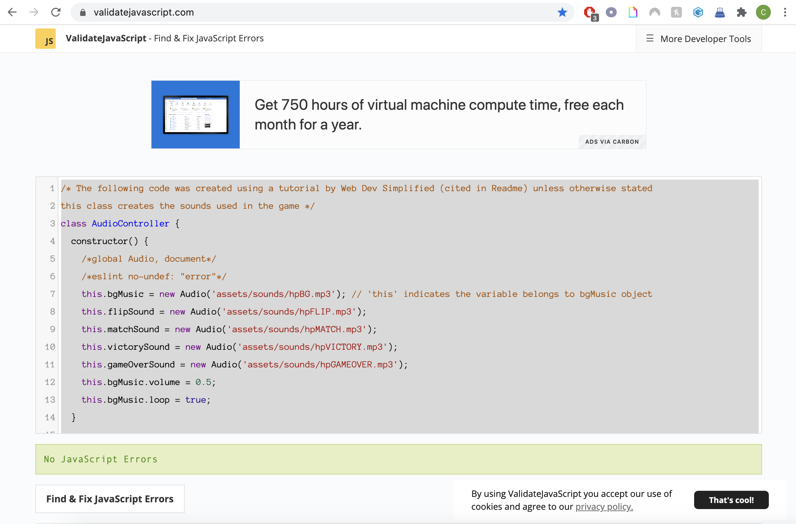
2. Animation Medium 
3. Animation Hard 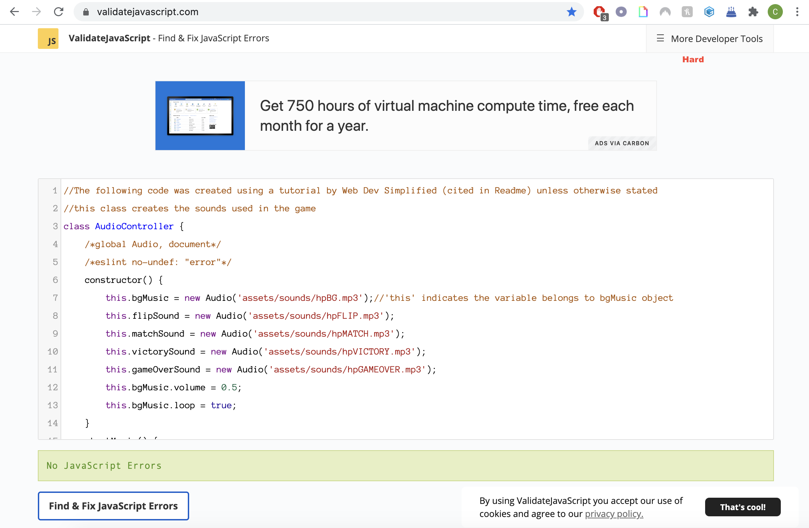
4. Script 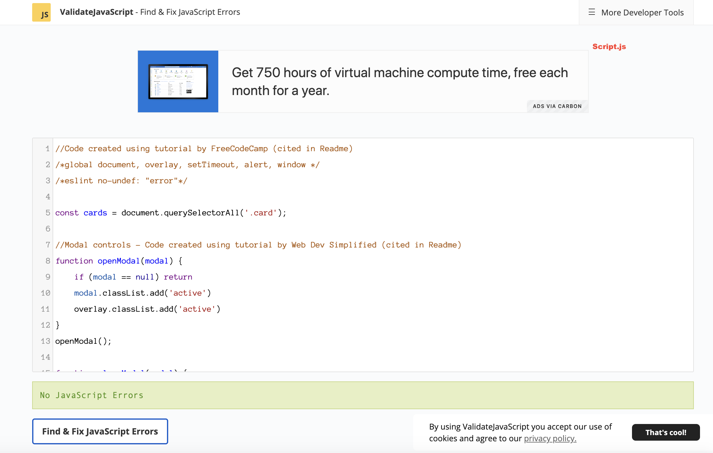
5. Script Medium 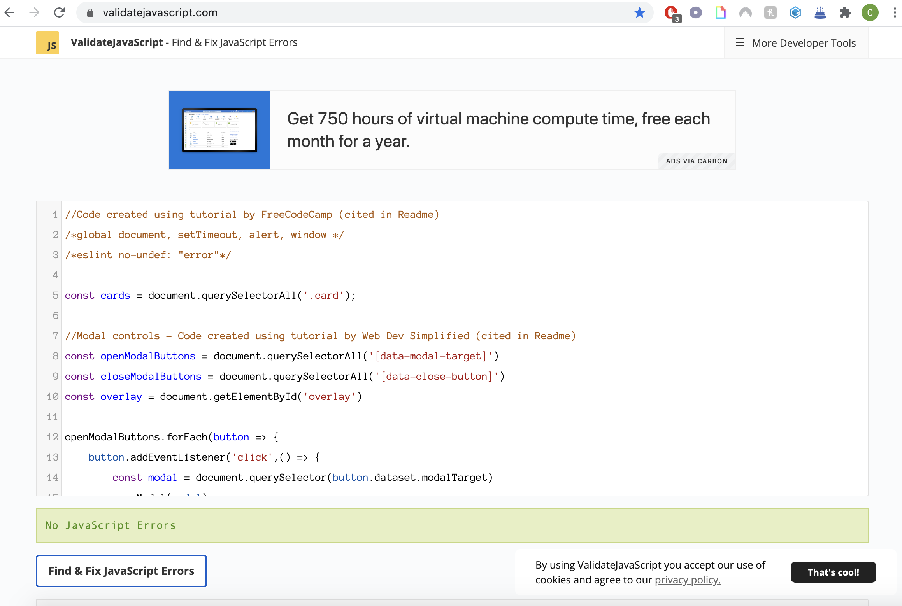
6. Script Hard 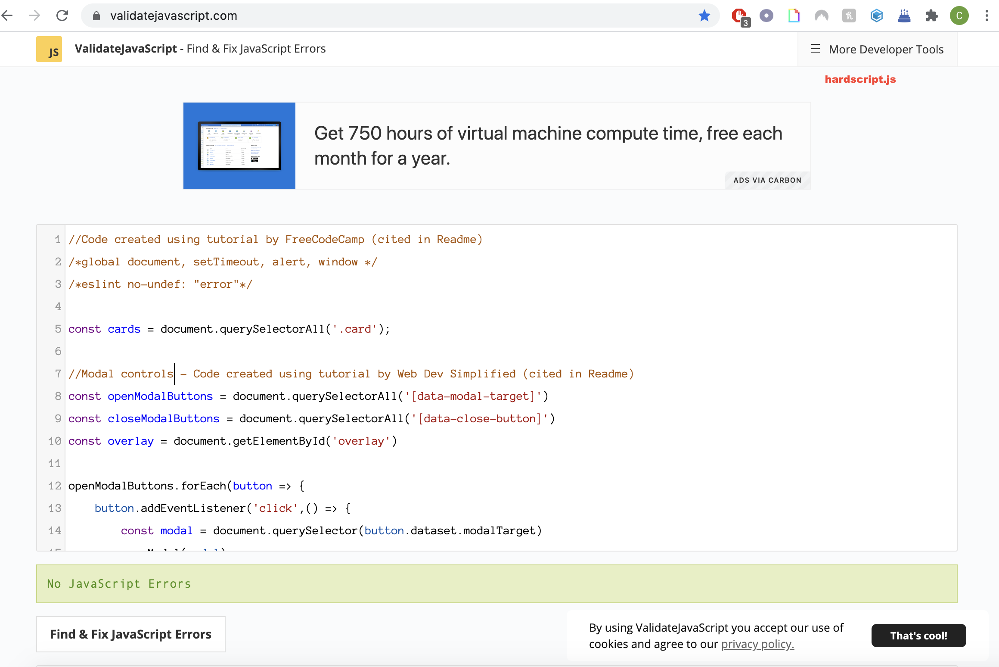

### Testing User Stories from User Experience (UX) Section

-   #### General User Goals

    1. "As a user, I want to be able to read instruction detailing how to play the game."

        1. The landing page contains a 'How to Play' explanatory text modal.
        
    2. "As a user,  I want to be able to toggle on/off the game's music."

        1. Each game level contains a 'Play/Pause' toggle sound option, enabling the user to turn the music on or off. 

    3. "As a user, I want to be able to keep track of the amount of flips it has taken me to complete the game."

        1. The flip counter - which keeps a running total of the flips - is clearly displayed above the game board.
        
    4. "As a user, I want to see how long it has taken me to complete the game."

        1. The Time counter - which displays the time and begins counting after the first flip - is clearly visible above the game board.
        
    5. "As a user, I want an alert when I get a match."

        1. A brief audio clip plays when two cards are matched. 


-   #### Casual Player Goals

    1. "As a casual gamer, my priority is a fun gameplay experience.".

        1. The Easy level is designed for entry-level play: the number of cards (12) is "manageable" and there is an extended time counter (100 seconds). This means the player can focus on the game task without worrying about time constraints.

    2. "As a casual gamer I want the gameplay mechanism to be immediately obvious."

        1. The layout of the game play page(s) follows a standard, familiar format - once the player clicks a card, they are shown the reverse side and the aim of the game becomes obvious: click cards over and find all the matches.

        2. The landing (index.html) page contains a clearly labelled 'How to play' button/modal which informs the player of the gameplay mechanics.

    3. "If a level is too hard, I want the option to quit."

        1. Each level contains a 'quit' button under the game board.
        2. The Game Over/ Victory contains a 'quit' option.


-   #### Experienced Player Goals

    1. "As an experienced gamer I want to be challenged."
        1. The game has 3 levels of difficulty, increasing in difficulty. The player can either clear each level, starting at Easy and playing through to Hard, or select from 'Easy', 'Medium' or 'Hard' in the Play menu on the game's landing page.
        2. The Hard level is designed to be a challenge even to experienced players, with limited time (60 seconds) to match 16 cards.

    2. "As an experienced gamer I want a game that encourages repeat plays."
        1. The incremental increase in difficulty encourages continuous, repeatitive play. 
        2. The difficulty of the Hard level, though not prohibitively difficult, is challenging enough that it should take more than one play to beat.


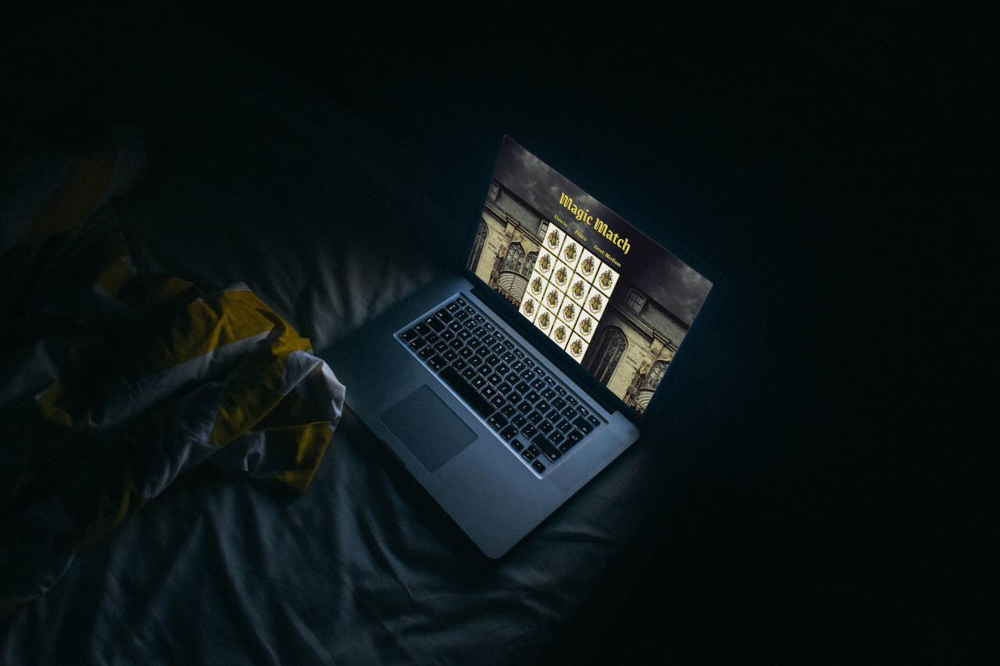


-   #### Game Designer's Goals

    1. "To engage and entertain both casual and experienced game players"

        1. This is achieved through a combination of easy-to-understand gameplay mechanics and the abilty to either select a level based on difficulty. 

    2. "To create an enjoyable, rewarding bug-free gameplay experience."

        1. Much testing has been done to assure that the game looks and plays well on all devices.

    3.  "To encourage multiple replays."

        1. This is achieved by making the game enjoyable and easy to interact. Players who 'beat' the Hard level are rewarded with an amusing message of congratulations from Professor Dumbledore.


### Further Testing

-   The game was tested on Chrome, Safari and Firefox browsers (Mac OS) 
-   The website was viewed and tested on a variety of devices, mobile and desktop (Samsung/iPhone SE & others via Chrome's Developer Tools). 
-   Friends and family members were asked to play the game and point out any bugs and/or user experience issues.


### Known Bugs

-   Resolved: Issue with cards not flipping in Safari - fixed as per [this](https://www.w3schools.com/cssref/css3_pr_backface-visibility.asp) W3 documentation.
-   Ongoing: Issue with font sizing on Game Options page on both iPhone 5 and Galaxy Fold devices in Chrome's Developer Tools, unresolved by media queries.
-   Occassional issue with victory modal not popping on Medium Level. 

## Deployment

### GitHub Pages

-   The project was deployed to GitHub Pages using the following steps...

1. Log in to GitHub and locate the [GitHub Repository](https://github.com/mcranter/Milestone-2)
2. At the top of the Repository (not top of page), locate the "Settings" Button on the menu.
    - Alternatively click [Here](https://raw.githubusercontent.com/) for a GIF demonstrating the process starting from Step 2.
3. Scroll down the Settings page until you locate the "GitHub Pages" Section.
4. Under "Source", click the dropdown called "None" and select "Master Branch".
5. The page will automatically refresh.
6. Scroll back down through the page to locate the now published site [link](https://mcranter.github.io/Milestone-2/index.html) in the "GitHub Pages" section.

### Forking the GitHub Repository

By forking the GitHub Repository we make a copy of the original repository on our GitHub account to view and/or make changes without affecting the original repository by using the following steps...

1. Log in to GitHub and locate the [GitHub Repository](https://github.com/mcranter/Milestone-2)
2. At the top of the Repository (not top of page) just above the "Settings" Button on the menu, locate the "Fork" Button.
3. You should now have a copy of the original repository in your GitHub account.

### Making a Local Clone

1. Log in to GitHub and locate the [GitHub Repository](https://github.com/mcranter/Milestone-2)
2. Under the repository name, click "Clone or download".
3. To clone the repository using HTTPS, under "Clone with HTTPS", copy the link.
4. Open Git Bash
5. Change the current working directory to the location where you want the cloned directory to be made.
6. Type `git clone`, and then paste the URL you copied in Step 3.

```
$ git clone https://github.com/mcranter/Milestone-2
```
7. Press Enter. Your local clone will be created.

```
$ git clone https://github.com/mcranter/Milestone-2
> Cloning into `CI-Clone`...
> remote: Counting objects: 10, done.
> remote: Compressing objects: 100% (8/8), done.
> remove: Total 10 (delta 1), reused 10 (delta 1)
> Unpacking objects: 100% (10/10), done.
```

Click [here](https://help.github.com/en/github/creating-cloning-and-archiving-repositories/cloning-a-repository#cloning-a-repository-to-github-desktop) to retrieve pictures for some of the buttons and more detailed explanations of the above process.


## Credits

### Code

-   The basic game mechanics including board creation, card flipping and the card shuffle algorithm are based on FreeCodeCamp's Youtube guide [here](https://youtu.be/ZniVgo8U7ek).

-   The victory/game over/start modals on the game pages were created using [this](https://youtu.be/28VfzEiJgy4) YouTube guide by [WebDev Simplified](https://www.youtube.com/channel/UCFbNIlppjAuEX4znoulh0Cw).

-   The flip count/timer counters/sounds and other animation functions were created using [this](https://youtu.be/3uuQ3g92oPQ) Youtube guide by [PortEXE](https://www.youtube.com/channel/UCjGQyJCSU_VVMTu5nigonqg).

-   [Bootstrap4](https://getbootstrap.com/docs/4.4/getting-started/introduction/): Bootstrap Library was used during the project for [Modal](https://getbootstrap.com/docs/4.0/components/modal/) creation.


### Content

-   All content was written by the developer unless otherwise stated.

### Media

-   Castle background image from [Pixabay](https://pixabay.com/photos/spooky-house-castle-haunted-1756641/)
-   All other images were created by the developer unless otherwise stated. 

-   Victory modal image by Tumblr user [floccinaucinihilipilification](https://floccinaucinihilipilificationa.tumblr.com/post/102292682900).


### Acknowledgements

-   Thanks to JK Rowling, creator of the Harry Potter series of books which inspired the theme of this game.

-   Thanks to my Mentor Precious Ijege for continuous helpful feedback.

-   Thanks to Tutor support at Code Institute for their support.

-   [W3 Schools](https://www.w3schools.com/)

-   [StackOverflow](http://stackoverflow.com/)
